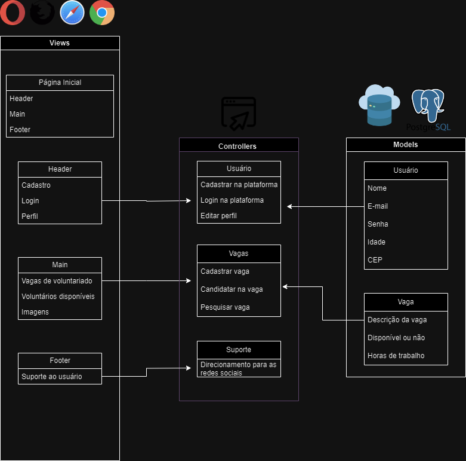

# Projeto Voluntariado

## Arquitetura MVC

#### Este projeto é uma plataforma de voluntariado que utiliza a arquitetura Modelo-Visão-Controlador (MVC) para organizar sua estrutura. Aqui está uma explicação dos elementos-chave do diagrama e como eles se relacionam:

### Views:

- **Header:** Contém links para as principais funcionalidades da plataforma, como cadastro, login e perfil.
  
- **Main:** Apresenta as principais seções da plataforma, como vagas de voluntariado, voluntários disponíveis e imagens.
  
- **Footer:** Fornece suporte ao usuário e pode conter informações de contato ou links para suporte.

### Controllers:

- **Usuário:** Responsável por gerenciar ações relacionadas aos usuários, como cadastro, login e edição de perfil.
  
- **Vagas:** Gerencia ações relacionadas às vagas de voluntariado, como cadastrar uma vaga, candidatar-se a uma vaga e pesquisar vagas.
  
- **Suporte:** Controla o suporte ao usuário e pode incluir redirecionamentos para redes sociais para mais informações ou suporte.

### Models:

- **Usuário:** Armazena informações dos usuários, como nome, e-mail, senha, idade e CEP.
  
- **Vaga:** Contém informações sobre as vagas de voluntariado, como descrição da vaga, disponibilidade e quantidade de horas que seram trabalhadas.

### PostgreSQL como Banco de Dados:

- Permite uma manipulação segura e eficiente dos dados do usuário e das vagas de voluntariado.
---

